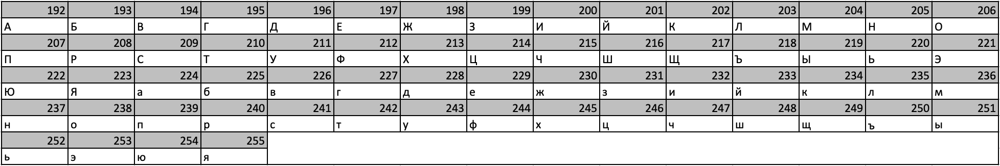

# Методы криптографии
### Описание
Данный курс познакомит вас с основами криптографии. Будут рассмотрены некоторые исторические шифры, лежащие в основе 
современных криптоалгоритмов. Современные алгоритмы шифрования: стандарты шифрования DES, AES, ГОСТ 28147-89, GSM, 
асимметричные алгоритмы шифрования и математические задачи, на которых они основываются (алгоритм RSA, криптосистема 
рюкзак). Поговорим о гибридных криптосистемах, также рассмотрим алгоритмы подписи, идею криптографических хэш-функций 
и немного поговорим о криптоанализе.

Ссылка на [openedu.ru](https://apps.openedu.ru/learning/course/course-v1:ITMOUniversity+CRYPT+spring_2023_ITMO_bac/home)
### Темы
1. Исторические шифры и основные понятия
2. Симметричные шифры часть 1
3. Симметричные шифры часть 2
4. Симметричные шифры часть 3
5. Асимметричное шифрование
6. Распределение ключей - протокол Диффи-Хеллмана, схемы подписей
7. Хэш-функции: семейство хэш-функций MD, хэш-функция SHA-1. Симметричное шифрование как способ создания хэш-функций
8. Криптоанализ и криптостойкость
9. Контрольная работа
## Исторические шифры и основные понятия
### Упражнение 1 - [решение](src/Task1.java)
1. При помощи шифра Виженера зашифруйте сообщение `самосборка`, используя ключ `задел`. В качестве алфавита использовать современный стандартный русский алфавит (33 буквы).
   - Ответ: `щаруэиофпл`


2. При помощи шифра Виженера расшифруйте сообщение `щаруцшуцпл`, используя ключ `задел`.
   - Ответ: `самокрутка`

## Симметричные шифры часть 1
### Упражнение 2 - [решение](src/Task2.java)
Дан следующий открытый текст `m`: `10100011110011110011`\
Произведите два раунда шифрования при помощи сети Фейстеля, если `k1=0010010100`, `k2=0110110000`,\
а в качестве шифрующей функции `F` выступает функция `XOR`.

Введите последовательность бит шифротекста (сцепление левого и правого блоков) после второго раунда.\
Ответ: `10111010001110101011`

## Симметричные шифры часть 2
### Упражнение 3 - [решение](src/Task3.java)
Дан следующий открытый текст, представленный в виде матрицы `4x4`:
```
2b aa a7 f2
d3 2d c8 2e
7b c6 59 54
70 3a 02 8c
```
Произведите один раунд шифрования при помощи алгоритма Rijndael, если `Roundkey` имеет вид:
```
b7 0c 55 e6
52 3f 15 44
73 68 96 29
64 ec df 7f
```
1. Введите элементы матрицы `state` после операции `SubBytes` (в шестнадцатиричном виде, все символы строчные).
   - Ответ:
```
f1 ac 5c 89 
66 d8 e8 31 
21 b4 cb 20 
51 80 77 64 
```

2. Введите элементы матрицы `state` после операции `ShiftRows` (в шестнадцатиричном виде, все символы строчные).
   - Ответ:
```
f1 ac 5c 89 
d8 e8 31 66 
cb 20 21 b4 
64 51 80 77 
```

3. Введите элементы матрицы `state` после операции `MixColumns` (в шестнадцатиричном виде, все символы строчные).
   - Ответ:
```
25 11 4a 60 
78 56 dd f5 
08 f7 b4 05 
d3 85 ef bc 
```

4. Введите элементы матрицы `state` после операции `AddKey` (в шестнадцатиричном виде, все символы строчные).
   - Ответ:
```
92 1d 1f 86 
2a 69 c8 b1 
7b 9f 22 2c 
b7 69 30 c3
```

## Симметричные шифры часть 3
### Упражнение 4 - [решение](src/Task4.java)
#### Задача 1
Дан следующий регистр сдвига: `1,1,0,0,1,0` и многочлен, задающий отводы: `X^5 + X^4 + X^3 + 1`
1. Вычислите период данного регистра сдвига:
    - Ответ: `7`


2. Введите последовательность выходящих бит, слева стоит последний получившийся бит.
    - Ответ: `1,1,1,0,0,1,0`

#### Задача 2
В урезанной версии RC-4, состоящей из регистра с `12` ячейками, провести пять тактов, ключ `key={11, 4, 10, 3, 5, 0, 2, 1, 9, 8, 7, 6}`
1. Введите элементы массива `S` после всех перестановок первого этапа (непосредственно перед генерацией потока `K`).
   - Ответ: `11,4,3,6,8,7,2,10,0,5,1,9` 


2. Введите первые пять значений потока ключа `K`. Нумерацию элементов потока производить справа налево (справа - первое получившееся значение, слева - последнее).
   - Ответ: `4,9,10,8,11` 

## Ассиметричное шифрования
### Упражнение 5 - [решение](src/Task5.java)
#### Задача 1
Пока Иван ехал в поезде, он случайно услышал разговор двух злоумышленников, которые обсуждали план ограбления музея `Пикассо`. Помогите Ивану восстановить безопасность музея — зашифруйте его название, чтобы Иван мог передать информацию о готовящемся нападении в полицию.
Для этого найдите закрытый ключ `{d, N}` используя числа `p=13`, `q=199`  и открытый ключ `{c, N}`, где `c=827`. Используйте алгоритм шифрования RSA.
1. Введите число `d`
    - Ответ: `2195`
    

2. Введите число `N`
   - Ответ: `2587`

Для кодирования букв используйте таблицу ASCII символов из следующих трехзначных кодов.


3. Введите получившуюся последовательность ASCII символов. Введите только числа без пробелов, запятых и прочих знаков.
    - Ответ: `207232234224241241238`
   

4. Зашифруйте последовательность ASCII символов. Каждая буква шифруется отдельно и должна быть представлена комбинацией из 4 цифр, если их меньше дополните нулями слева. Введите только числа без пробелов, запятых и прочих знаков.
    - Ответ: `0064168306631023201720170959`


#### Задача 2
Иван сдал сессию на отлично и решил отдохнуть как следует на каникулах и отправиться в путешествие. Как настоящий патриот своей страны, он отправился по городам и весям России-матушки, а именно в `04353523275817212052`.\
Название Иван зашифровал открытым ключом `{3163, 4853}`, используя алгоритм шифрования RSA.\
Дешифруйте название города закрытым ключом `{3247, 4853}`. Будьте внимательны, Иван был коварен, и перепутал регистр букв.

*Для кодирования букв была использована таблица ASCII символов из трехзначных кодов, указанная выше, но в результате шифрования коды стали длиной 4 знаков. Не забывайте про регистр при вводе ответа!*

Введите слово, получившееся в результате дешифровки
- Ответ: `ЛИвны`

## Распределение ключей - протокол Диффи-Хеллмана, схемы подписей
### Упражнение 6 - [решение](src/Task6.java)
Создайте при помощи алгоритма DSA цифровую подпись со следующими параметрами.

| Параметр  | Значение                                                                                                                                                                                                                                                                                                                |
|:---------:|:------------------------------------------------------------------------------------------------------------------------------------------------------------------------------------------------------------------------------------------------------------------------------------------------------------------------|
|     P     | `166463376516400426457141515104566173785856035498896721857360191000830037660746843986602958707228415904253202234300944501270586733632418193908609869522918666622719348429564638751664928414142733358346373069590470043643120383033778157172431539992689397303360775161135822672339278566888972237062904143856449494121` |
|     Q     | `800639140554576815355142856850966681154603819183`                                                                                                                                                                                                                                                                      |
|     G     | `25023825924299564725223445047359641289150680212074757345632412296768112224011958375110364984100703119978015411128467189756940390362310345135543390310055478159471967765083076992415072847471209888076243150438305612399766814782976986655686373462542738634533732066661512634533218739435839206612529941279491181770`  |
|     x     | `537745557718734956418968819717440405817477740120`                                                                                                                                                                                                                                                                      |
|     k     | `163142036525505604391766718652009268100024523186`                                                                                                                                                                                                                                                                      |
|   h(m)    | `1452173985408750203318475117189636062911214042143`                                                                                                                                                                                                                                                                     |

1. Введите открытый ключ `Y`
   - Ответ: `49760559326322262032752410350482586517209934816439601752909406679243268397105587906690978421171012675984743311718003907725487081620483793337639822832367534494100784737625526795496548371744974815702300713974008172008173049060440840067429048248874379627765814162279490377211700874282450079612535599305092239201` 


2. Введите открытый ключ `R`
   - Ответ: `542952525004445346973927151413057076815010145611` 


3. Введите открытый ключ `S`
   - Ответ: `741535339082704527164883922609965445071494909617`

## Конторольная работа
### Зачётное задание - [решение](src/Exam.java)
В качестве зачетного задания предлагается произвести дешифровку некоторого сообщения. Ниже представлены два изображения, в которых зашифрован текст фрагмента литературного произведения.

Шифрование производилось следующим образом:
1. Был выбран фрагмент текста известного литературного произведения.


2. Весь текст был приведён к нижнему регистру.


3. Из текста были удалены все символы кроме пробелов (кодируются числом `32`), переходов на новую строку (кодируются числом `10`)и символов под номерами `[224, 255]` из следующей таблицы:
   


4. Было произведено шифрование при помощи алгоритма RSA со следующими параметрами: `d=8135`, `p=97`, `p=149`. При этом каждый символ шифровался отдельно и был представлен комбинацией (блоком) из `5` цифр (если цифр было меньше, блок дополнялся нулями слева).


5. Из полученной последовательности блоков (по `5` цифр в каждом) было выделено первые `10000` блоков, которые затем были представлены в виде матрицы размером `100x100`.


6. Для каждого элемента полученной матрицы было произведено деление с остатком на число `256`. В результате чего были получены две матрицы размера `100x100`: матрица целых частей от деления на `256` и матрица остатков от деления на `256`.


7. Полученные матрицы и были представлены в виде изображений в градации серого со значениями интенсивности пикселей в диапазоне `[0, 255]`.

Данные в формате csv:
- [матрица целых частей](data/array_int_parts_3.csv)
- [матрица остатков от деления](data/array_remainders_3.csv)

Введите фамилию (без имени или инициалов) автора закодированного произведения
- Ответ: `филатов`